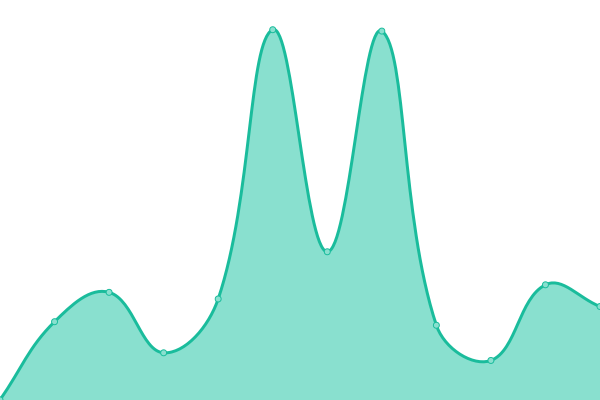

# [📈 Live Status](https://status.jeikobu.net): <!--live status--> **🟩 All systems operational**

This repository contains the open-source uptime monitor and status page for [Shindou Jeikobu](http://jeikobu.net), powered by [Upptime](https://github.com/upptime/upptime).

With [Upptime](https://upptime.js.org), you can get your own unlimited and free uptime monitor and status page, powered entirely by a GitHub repository. We use [Issues](https://github.com/shindouj/uptime/issues) as incident reports, [Actions](https://github.com/shindouj/uptime/actions) as uptime monitors, and [Pages](https://status.jeikobu.net) for the status page.

<!--start: status pages-->
<!-- This summary is generated by Upptime (https://github.com/upptime/upptime) -->
<!-- Do not edit this manually, your changes will be overwritten -->
<!-- prettier-ignore -->
| URL | Status | History | Response Time | Uptime |
| --- | ------ | ------- | ------------- | ------ |
|  [SearXNG](https://search.jeikobu.net) | 🟩 Up | [sear-xng.yml](https://github.com/shindouj/uptime/commits/HEAD/history/sear-xng.yml) | 

 625ms
     
 | 

<a href="https://status.jeikobu.net/history/sear-xng">100.00%</a>
    

|  [Redlib (for Reddit)](https://redlib.jeikobu.net) | 🟩 Up | [redlib-for-reddit.yml](https://github.com/shindouj/uptime/commits/HEAD/history/redlib-for-reddit.yml) | 

 703ms
     
 | 

<a href="https://status.jeikobu.net/history/redlib-for-reddit">19.81%</a>
    

|  [Quetre (for Quora)](https://quetre.jeikobu.net) | 🟩 Up | [quetre-for-quora.yml](https://github.com/shindouj/uptime/commits/HEAD/history/quetre-for-quora.yml) | 

 538ms
     
 | 

<a href="https://status.jeikobu.net/history/quetre-for-quora">100.00%</a>
    

|  [LibremDB (for IMDB)](https://libremdb.jeikobu.net) | 🟩 Up | [librem-db-for-imdb.yml](https://github.com/shindouj/uptime/commits/HEAD/history/librem-db-for-imdb.yml) | 

 1200ms
     
 | 

<a href="https://status.jeikobu.net/history/librem-db-for-imdb">100.00%</a>
    

|  [Dumb (for Genius)](https://dumb.jeikobu.net) | 🟩 Up | [dumb-for-genius.yml](https://github.com/shindouj/uptime/commits/HEAD/history/dumb-for-genius.yml) | 

 604ms
     
 | 

<a href="https://status.jeikobu.net/history/dumb-for-genius">100.00%</a>
    

|  [Mozhi (translation services)](https://mozhi.jeikobu.net) | 🟩 Up | [mozhi-translation-services.yml](https://github.com/shindouj/uptime/commits/HEAD/history/mozhi-translation-services.yml) | 

 637ms
     
 | 

<a href="https://status.jeikobu.net/history/mozhi-translation-services">100.00%</a>
    

|  [Rimgo (for Imgur)](https://rimgo.jeikobu.net) | 🟩 Up | [rimgo-for-imgur.yml](https://github.com/shindouj/uptime/commits/HEAD/history/rimgo-for-imgur.yml) | 

 620ms
     
 | 

<a href="https://status.jeikobu.net/history/rimgo-for-imgur">100.00%</a>
    

|  [OpenTogetherTube](https://watchtogether.jeikobu.net) | 🟩 Up | [open-together-tube.yml](https://github.com/shindouj/uptime/commits/HEAD/history/open-together-tube.yml) | 

 614ms
     
 | 

<a href="https://status.jeikobu.net/history/open-together-tube">100.00%</a>
    

|  [Chihiro Paste](https://p.chihi.ro) | 🟩 Up | [chihiro-paste.yml](https://github.com/shindouj/uptime/commits/HEAD/history/chihiro-paste.yml) | 

 690ms
     
 | 

<a href="https://status.jeikobu.net/history/chihiro-paste">100.00%</a>
    

<!--end: status pages-->

[**Visit our status website →**](https://status.jeikobu.net)

## 📄 License

- Powered by: [Upptime](https://github.com/upptime/upptime)
- Code: [MIT](./LICENSE) © [Anand Chowdhary](https://anandchowdhary.com), supported by [Pabio](https://pabio.com)
- Data in the `./history` directory: [Open Database License](https://opendatacommons.org/licenses/odbl/1-0/)
